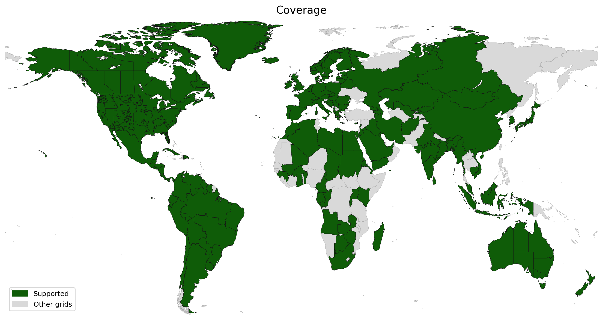

# CarbonX
Repository for CarbonX

## Installing Dependencies
To run CarbonX, you need to first install all the required packages. We recommend creating a Python v3.11 virtual environment for this, since MOMENT is not compatible with later Python versions.

Script to install Python3.11:
```
cd ~
wget https://www.python.org/ftp/python/3.11.9/Python-3.11.9.tgz
tar -xvf Python-3.11.9.tgz
cd Python-3.11.9
./configure --prefix=$HOME/python311 --enable-optimizations
make -j
make install
```
After that, add Python3.11.9 to PATH.

Script to create virtual environment and install dependencies:
```
python3.11 -m venv .venv
source .venv/bin/activate
pip3 install momentfm
pip3 install timesfm
pip3 install transformers==4.40.1
python3 -m pip install git+https://github.com/amazon-science/chronos-forecasting.git
pip3 install pandas numpy json5 torch accelerate matplotlib scikit-learn
```

## Running CarbonX
Run the CarbonX file with the desired model and API (for now, you need to manually uncomment the API calls within the file).
```
python3 carbonx.py 
```

### API List:

| **Function**               | **Parameters**                  | **Returns**           | **Description**                                                                                                                                                       |
|---------------------------|----------------------------------|-----------------------|-----------------------------------------------------------------------------------------------------------------------------------------------------------------------|
| `get_ci_historical()`     | `grid`, `date`                   | Hourly CI             | Get historical carbon intensity (CI) for the specified grid and date.                                                                                                 |
| `get_ci_forecasts()`      | `grid`, `date`, `horizon`, `PI`  | Hourly CI forecasts   | Get CI forecasts for the given horizon hours (max 96) on the specified date. Returns prediction intervals if `PI` is `True`.                                          |
| `get_forecast_accuracy()` | `grid`, `date`, `horizon`        | MAPE (%)              | Get CI forecasting accuracy for the given horizon hours (max 96) on the specified date. Returns error if ground truth is not available.  |
| `get_missing_ci_data()`   | `CI series`, `mask`              | Imputed CI            | Get imputed CI data from the specified series. A mask value of 0 indicates missing data. |
| `get_supported_grids()`   | —                                | Grid list             | List of currently supported grids.   |
| `set_model()`             | `model_name`, `mode`             | Success / Failure     | Specify the TSFM model and mode (`ZS`, `FT`). |


## Supported Grids

### Benchmarking:

1. **Australia:** Queensland (AU-QLD)
2. **Europe:** Germany (DE), Netherlands (NL), Spain (ES), Poland (PL), Sweden (SE)
3. **United States:** California (US-CAL-CISO), Florida (US-FLA-FPL), New England (US-NE-ISNE), New York (US-NY-NYIS), Pennsylvania-New Jersey-Maryland (US-MIDA-PJM), Texas (US-TEX-ERCO), Washington (US-NW-BPAT)
   
**Total:** 13 grids.

**Date range:** 2020-01-01 to 2021-12-31

### Worldwide Forecasting:



1. **Africa:** AO, BF, BI, BJ, BW, CG, CM, DJ, DZ, EG, ER, GA, GH, GN, GQ, KE, LY, MA, MG, ML, RW, SD, TD, UG, YE, ZA, ZM, ZW
2. **Asia:** AE, AF, AM, AZ, BD, BH, BT, CN, CY, HK, ID, IN-EA, IN-NE, IN-NO, IN, IN-SO, IN-WE, IQ, IR, JO, JP-KY, JP, JP-TK, KG, KH, KR, KW, KZ, LB, LK, MM, MN, MY-EM, MY, MY-WM, SA, SG, UZ, VN
3. **Central America:** BZ, CR, CU, DO, GT, HN, NI, PA, SV
4. **Europe:** AL, AT, BA, BE, BG, BY, CH, CZ, DE, DK, EE, ES, FI, FR, GB-NIR, GB, GE, GL, GR, HR, HU, IE, IS, IT, LT, LU, LV, MD, MT, NL, NO, PL, PT, RO, RS, RU-1, RU-2, SE, SK 
5. **North America:** CA-AB, CA-BC, CA-MB, CA-NB, CA-NL, CA-NS, CA-NT, CA-NU, CA-ON, CA-PE, CA-QC, CA-SK, CA-YT, MX, US-AK-SEAPA, US-AK, US-CAL-BANC, US-CAL-CISO, US-CAL-IID, US-CAL-LDWP, US-CAL-TIDC, US-CAR-CPLE, US-CAR-CPLW, US-CAR-DUK, US-CAR-SCEG, US-CAR-SC, US-CAR-YAD, US-CENT-SPA, US-CENT-SWPP, US-FLA-FMPP, US-FLA-FPC, US-FLA-FPL, US-FLA-GVL, US-FLA-HST, US-FLA-JEA, US-FLA-SEC, US-FLA-TAL, US-FLA-TEC, US-HI, US-MIDA-PJM, US-MIDW-AECI, US-MIDW-LGEE, US-MIDW-MISO, US-NE-ISNE, US-NW-AVA, US-NW-BPAT, US-NW-CHPD, US-NW-DOPD, US-NW-GCPD, US-NW-GRID, US-NW-IPCO, US-NW-NEVP, US-NW-NWMT, US-NW-PACE, US-NW-PACW, US-NW-PGE, US-NW-PSCO, US-NW-PSEI, US-NW-SCL, US-NW-TPWR, US-NW-WACM, US-NW-WAUW, US-NY-NYIS, US-SE-SEPA, US-SE-SOCO, US-SW-AZPS, US-SW-EPE, US-SW-PNM, US-SW-SRP, US-SW-TEPC, US-SW-WALC, US-TEN-TVA, US-TEX-ERCO
6. **Oceania:** AU-NSW, AU-NT, AU-QLD, AU-SA, AU-TAS-FI, AU-TAS-KI, AU-TAS, AU-VIC, AU-WA-RI, AU-WA, NZ
7. **South America:** AR, BO, BR-CS, BR-NE, BR-N, BR-S, CL-SEN, CO, EC, GY, PE, PY, SR, UY, VE

**Total:** 214 grids. 

**Date range:** 2021-01-01 to 2024-12-31

CarbonX can do forecasting on any new grids with minimal changes. If you need to forecast carbon intensity for any other grid, add the relevant data files in ```data/forecasting-data``` and update the ```config.json``` file.

### Imputation:
The following are the grids we evaluated for the imputation task. 

1. **Europe:** BE, CH, DE, DK, ES, FI, FR, GB, GR, HR, HU, IE, IT, LT, LV, NL, PL, PT, SE, SI
2. **United States:** US-CAL-CISO, US-CAL-LDWP, US-CAR-DUK, US-CENT-SPA, US-CENT-SWPP, US-FLA-FMPP, US-FLA-FPC, US-FLA-FPL, US-MIDA-PJM, US-MIDW-AECI, US-MIDW-MISO, US-NE-ISNE, US-NW-BPAT, US-NW-CHPD, US-NW-IPCO, US-NW-NEVP, US-NW-NWMT, US-NW-PACE, US-NW-PACW, US-NW-PSCO, US-NW-PSEI, US-NW-TPWR, US-NW-WACM, US-NY-NYIS, US-SE-SEPA, US-SE-SOCO, US-SW-PNM, US-SW-SRP, US-SW-WALC, US-TEX-ERCO

**Total:** 50 grids.

**Date range:** 2021-01-01 to 2024-12-31

CarbonX can do imputation on any grids supported for other tasks as well. If you need to impute data for any other grid, add the relevant data files in ```data/imputation-data``` and update the ```config.json``` file.

## Supported Models

The following models and modes are supported. While we evaluated all the models below, some code needs to be cleaned up before release. We will upload all the models soon ( :soon::hourglass_flowing_sand: ).

### Forecasting: Zero-shot Mode

1. [Chronos](https://github.com/amazon-science/chronos-forecasting) :white_check_mark:
2. [MOMENT](https://github.com/moment-timeseries-foundation-model/moment) :white_check_mark:
3. [Sundial](https://github.com/thuml/Sundial/tree/main) :white_check_mark:
4. [Time-MoE](https://github.com/Time-MoE/Time-MoE) :white_check_mark:
5. [Times-FM](https://github.com/google-research/timesfm) :white_check_mark:

### Forecasting: Domain-Specific Fine-Tuned Mode
1. [Chronos](https://github.com/amazon-science/chronos-forecasting) :soon::hourglass_flowing_sand:
2. [Time-MoE](https://github.com/Time-MoE/Time-MoE) :soon::hourglass_flowing_sand:

### Forecasting: Region-Specific Fine-Tuned Mode
1. [Chronos](https://github.com/amazon-science/chronos-forecasting) :soon::hourglass_flowing_sand:
2. [MOMENT](https://github.com/moment-timeseries-foundation-model/moment) :soon::hourglass_flowing_sand:
3. [Time-MoE](https://github.com/Time-MoE/Time-MoE) :soon::hourglass_flowing_sand:
4. [Times-FM](https://github.com/google-research/timesfm) :soon::hourglass_flowing_sand:

### Imputation: Zero-shot/Fine-Tuned
1. [MOMENT](https://github.com/moment-timeseries-foundation-model/moment) :soon::hourglass_flowing_sand:


## Supported tasks/features:
The following tasks/features are currently provided in the repository. We are working on cleaning the code for the other features and will release it soon.

1. Point-value forecasting: :white_check_mark:
2. Extended forecasting (up to 21 days): :white_check_mark:
3. Uncertainty Quantification: :soon::hourglass_flowing_sand:
4. Imputation: :soon::hourglass_flowing_sand:


